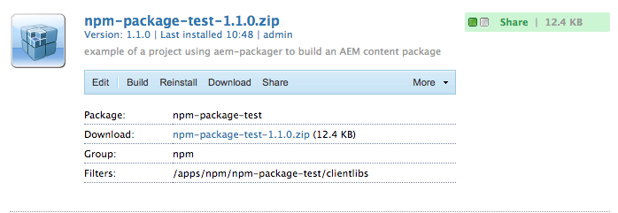

[](https://travis-ci.org/amclin/aem-packager)
[](https://badge.fury.io/js/aem-packager)
[](https://david-dm.org/amclin/aem-packager)
[](https://david-dm.org/amclin/aem-packager?type=dev)
[](https://app.codacy.com/app/mailfrom/aem-packager?utm_source=github.com&utm_medium=referral&utm_content=amclin/aem-packager&utm_campaign=Badge_Grade_Dashboard)
[](https://codebeat.co/projects/github-com-amclin-aem-packager-master)
# aem-packager
Creates AEM packages for NodeJS projects that can then be installed through the Adobe Experience Manager package manager. Combined with the [aem-clientlib-generator](https://www.npmjs.com/package/aem-clientlib-generator) this provides a rich end-to-end workflow for developing JS and CSS for injection into AEM as components, libraries, applications, or contents.

1.  [Using](#using)
    *   [Example Project](https://github.com/amclin/aem-packager-example)

2.  [Dependencies](#dependencies)

3.  [Configuration](#configuration)
    1.  [Packager Options](#options)
    2.  [Package Defines](#defines)

## Using
Install **aem-packager** as a dependency for your NodeJS project:

`npm install --save aem-packager`

Add the Maven working directory to your `.gitignore` so you don't have unecessary files in your source control:

`./target`

Make sure that your `package.json` has the `name`, `description`, and `version` all filled in:

```json
{
  "name": "my-npm-project",
  "description": "My project does something interesting.",
  "version": "1.0.0",
  "dependencies": {...}
}
```

If your project doesn't currently put its build ouptut in the `/dist` folder, then set the [source directory](#buildDir).

Add a package script to your `package.json`:

```json
  "scripts": {
    "build": "my build script",
    "package": "aem-packager",
    "test": "my test script"
  }
```

Run your build process as normal. After your build completes, then run the packager:

`npm run package`

The resulting `.zip` file will be outpt to the `target` folder by default. You should be able to take that file and upload it and install it through [AEM's package manager](https://helpx.adobe.com/experience-manager/6-3/sites/administering/using/package-manager.html).



### Package Filename
AEM requires SEMVER versioning in order for packages to be recognized as version updates. AEM also cannot safely install an older version of a package over a new version, which is why the filename contains a timestamp to guarantee sequential uniqueness.

The output package name uses the pattern:

`{groupId}-{artifactId}-{version}-{timestamp}.zip`

#### Example Filename

`npm-package-test-1.1.0-2018-10-31T18-22-42Z.zip`

## Dependencies
**aem-packager** is a wrapper around [Adobe's Maven plugin](https://helpx.adobe.com/experience-manager/6-3/sites/developing/using/vlt-mavenplugin.html) for building content packages. Therefore, you will need [Maven installed on your system](https://maven.apache.org/install.html).

## Configuration

### Basics
Configuration of *aem-packager* has 2 distinct parts. [Options](#options) are used for setting how the packaging process runs, and [Defines](#defines) are used to override specific variables within the final package. Both `options` and `defines` can be configured by defining an object containing those two properties:

```json
{
  "options": {...},
  "defines": {...}
}
```

### Specifying Configurations
The configurations can be provided in one of 2 ways:

1.  Set the configuration in your [`package.json`](#packagejson-configuration-example)
2.  Specify your own [YAML or JSON config file](#configuration-file)

#### package.json configuration example
```json
{
  "name": "my-npm-project",
  "description": "My AEM package for cool features.",
  "version": "0.2.3",
  "scripts": {...},
  "dependencies": {...},
  "aem-packager": {
    "options": {
        "srcDir": "dist",
        "buildDir": "target",
        "jcrPath": "/apps/mygroup/myapp/clientlibs"
    },
    "defines": {
        "artifactId": "my-project",
        "groupId": "org.example.myprojectgroup",
        "version": "1.2.3"
    }
  }
}
```

#### Configuration File
You can specify your own JSON or YAML config file through a command line argument when running aem-packager:

`aem-packager --config ./config/my-config-file.yml`

##### YAML Config File Exapmle
```yaml
options:
  srcDir: dist
  buildDir: target
  jcrPath: /apps/mygroup/myapp/clientlibs
defines:
  artifactId: my-project
  description: My AEM package for cool features.
  groupId: org.example.myprojectgroup
  version: '1.2.3'
```

### Packager Options
The settings for running the packager are populated through the `options` object. This can be added to your project's `package.json` as a `aem-packager.options` section.

```json
"name": "my-npm-project",
"scripts": {...},
"dependencies": {...},
"aem-packager": {
    "options": {
        "srcDir": "dist",
        "buildDir": "target"
        "jcrPath": "/apps/mygroup/myapp/clientlibs"
    },
    "defines": {...}
}
```

#### srcDir (string)
The directory where your compiled files are located waiting to be packaged. Defaults to `dist` when not provided. All files within the folder will be included in the AEM package, so make sure that the output has been sanitized to only the files you wish to deploy.

#### buildDir (string)
The working directory that Maven will use for compiling the build package. Defaults to `target` when not provided.

#### jcrPath (string)
The path in the JCR (AEM's storage system) where the module will be installed. Since most npm projects will likely be generating JS, CSS, and HTML assets, the default here when left blank, this will use the [`groupId`](#groupId) and [`artifactId`](#artifactId) to complete generate the full pattern `/apps/<groupId>/<artifactId>/clientlibs`

### Defines
In addition to [configuring how the packager runs](#Options), you can also set Maven **defines** which provide specific values in the resulting installable AEM package. The primary required values for generating an AEM package will be automatically be extracted from your project's `package.json`, but they can be overridden by adding a `defines` object to your project's `package.json` as a `aem-packager.defines` section.

```json
"name": "my-npm-project",
"scripts": {...},
"dependencies": {...},
"aem-packager": {
    "options": {...},
    "defines": {
        "artifactId": "my-project",
        "description": "My AEM package for cool features.",
        "groupId": "org.example.myprojectgroup",
        "version": "1.2.3"
    }
}
```

#### artifactId
Used within AEM's package management to identify the package. Default value if unset will be the npm project name from your project's `package.json`. Must be a machine-safe string. Restricting to lowercase and hypphens is recommended to prevent conflicts.

##### Example of artifactId
```json
"artifactId": "my-project"
```

#### description
Human-readable description that will be used for the AEM content package. When not defined, this will default to the description string provided by your project's `package.json`.

##### Example of description
```json
"description": "My AEM package for cool features."
```

#### groupId
Used within AEM's package management to group related packages together. The naming convention in AEM packages typically followsJava package naming so it is easy to find specific packages in the AEM package manager. This must be a machine-safe string.

##### Scoped vs Non-Scoped packages
*   If your [NPM package is scoped](https://docs.npmjs.com/getting-started/scoped-packages), then the default value of `groupId` will be the scope of your package. For example, for a package named `@foo/mypackage`, the default `groupId` will be `foo`
*   If your NPM package is not scoped, then the default `groupId` will be the generic fallback `npm`. 

##### Example of groupId
For a company called "Example.org":
```json
"groupId": "org.example.myprojectgroup"
```

#### version
Force the version number that will be used for the AEM content package. When not defined, this will default to the version string provided by your project's `package.json`. Must be a [SEMVER](https://semver.org/) value.

##### Example of version
```json
"version": "1.0.0"
```
## More Info
*   Need more help in getting this working? See [aem-packager-example](https://github.com/amclin/aem-packager-example) for an example end-to-end NodeJS project that produces an installable AEM package.
*   Need to create AEM's clientlib folder structures and manifests? See [aem-clientlib-generator](https://www.npmjs.com/package/aem-clientlib-generator)

[](https://nodei.co/npm/aem-packager/)
